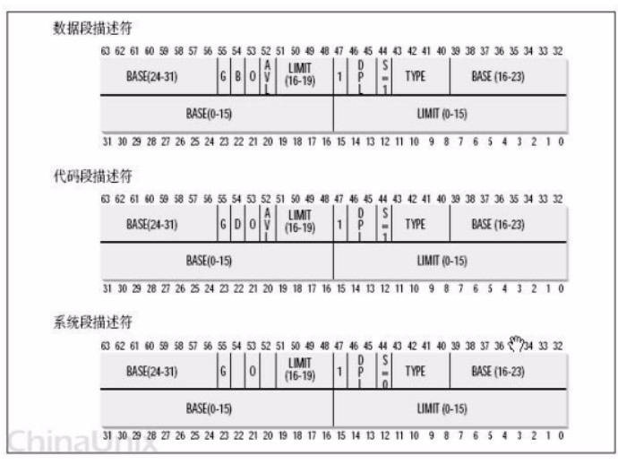
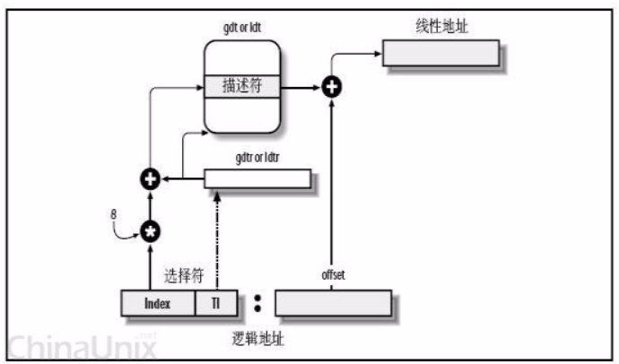
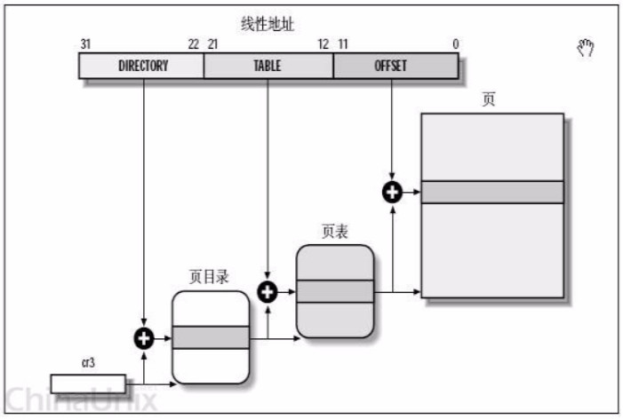

<!-- START doctoc generated TOC please keep comment here to allow auto update -->
<!-- DON'T EDIT THIS SECTION, INSTEAD RE-RUN doctoc TO UPDATE -->

- [牛客操作系统面经汇总](#%E7%89%9B%E5%AE%A2%E6%93%8D%E4%BD%9C%E7%B3%BB%E7%BB%9F%E9%9D%A2%E7%BB%8F%E6%B1%87%E6%80%BB)
  - [A、线程、进程与同步](#a%E7%BA%BF%E7%A8%8B%E8%BF%9B%E7%A8%8B%E4%B8%8E%E5%90%8C%E6%AD%A5)
    - [一、进程与线程的概念与区别](#%E4%B8%80%E8%BF%9B%E7%A8%8B%E4%B8%8E%E7%BA%BF%E7%A8%8B%E7%9A%84%E6%A6%82%E5%BF%B5%E4%B8%8E%E5%8C%BA%E5%88%AB)
    - [二、进程间通信的方式](#%E4%BA%8C%E8%BF%9B%E7%A8%8B%E9%97%B4%E9%80%9A%E4%BF%A1%E7%9A%84%E6%96%B9%E5%BC%8F)
    - [三、线程间通信的方式](#%E4%B8%89%E7%BA%BF%E7%A8%8B%E9%97%B4%E9%80%9A%E4%BF%A1%E7%9A%84%E6%96%B9%E5%BC%8F)
    - [四、有了进程，为什么还要有线程](#%E5%9B%9B%E6%9C%89%E4%BA%86%E8%BF%9B%E7%A8%8B%E4%B8%BA%E4%BB%80%E4%B9%88%E8%BF%98%E8%A6%81%E6%9C%89%E7%BA%BF%E7%A8%8B)
    - [五、多进程和多线程的使用场景](#%E4%BA%94%E5%A4%9A%E8%BF%9B%E7%A8%8B%E5%92%8C%E5%A4%9A%E7%BA%BF%E7%A8%8B%E7%9A%84%E4%BD%BF%E7%94%A8%E5%9C%BA%E6%99%AF)
    - [六、单核机器上写多线程程序，是否需要考虑加锁](#%E5%85%AD%E5%8D%95%E6%A0%B8%E6%9C%BA%E5%99%A8%E4%B8%8A%E5%86%99%E5%A4%9A%E7%BA%BF%E7%A8%8B%E7%A8%8B%E5%BA%8F%E6%98%AF%E5%90%A6%E9%9C%80%E8%A6%81%E8%80%83%E8%99%91%E5%8A%A0%E9%94%81)
    - [七、互斥锁和读写锁](#%E4%B8%83%E4%BA%92%E6%96%A5%E9%94%81%E5%92%8C%E8%AF%BB%E5%86%99%E9%94%81)
      - [1、互斥锁和读写锁区别](#1%E4%BA%92%E6%96%A5%E9%94%81%E5%92%8C%E8%AF%BB%E5%86%99%E9%94%81%E5%8C%BA%E5%88%AB)
      - [2、Linux的4种锁机制](#2linux%E7%9A%844%E7%A7%8D%E9%94%81%E6%9C%BA%E5%88%B6)
    - [八、死锁](#%E5%85%AB%E6%AD%BB%E9%94%81)
    - [九、线程需要保存哪些上下文，SP、PC、EAX寄存器的作用](#%E4%B9%9D%E7%BA%BF%E7%A8%8B%E9%9C%80%E8%A6%81%E4%BF%9D%E5%AD%98%E5%93%AA%E4%BA%9B%E4%B8%8A%E4%B8%8B%E6%96%87sppceax%E5%AF%84%E5%AD%98%E5%99%A8%E7%9A%84%E4%BD%9C%E7%94%A8)
    - [十、游戏服务器应该为每个用户开辟一个线程还是一个进程](#%E5%8D%81%E6%B8%B8%E6%88%8F%E6%9C%8D%E5%8A%A1%E5%99%A8%E5%BA%94%E8%AF%A5%E4%B8%BA%E6%AF%8F%E4%B8%AA%E7%94%A8%E6%88%B7%E5%BC%80%E8%BE%9F%E4%B8%80%E4%B8%AA%E7%BA%BF%E7%A8%8B%E8%BF%98%E6%98%AF%E4%B8%80%E4%B8%AA%E8%BF%9B%E7%A8%8B)
    - [十一、并发(concurrency)和并行(parallelism)](#%E5%8D%81%E4%B8%80%E5%B9%B6%E5%8F%91concurrency%E5%92%8C%E5%B9%B6%E8%A1%8Cparallelism)
    - [十二、fork和vfork的区别](#%E5%8D%81%E4%BA%8Cfork%E5%92%8Cvfork%E7%9A%84%E5%8C%BA%E5%88%AB)
    - [十三、进程状态转换图，动态就绪，静态就绪，动态阻塞，静态阻塞](#%E5%8D%81%E4%B8%89%E8%BF%9B%E7%A8%8B%E7%8A%B6%E6%80%81%E8%BD%AC%E6%8D%A2%E5%9B%BE%E5%8A%A8%E6%80%81%E5%B0%B1%E7%BB%AA%E9%9D%99%E6%80%81%E5%B0%B1%E7%BB%AA%E5%8A%A8%E6%80%81%E9%98%BB%E5%A1%9E%E9%9D%99%E6%80%81%E9%98%BB%E5%A1%9E)
      - [1、进程的五种基本状态](#1%E8%BF%9B%E7%A8%8B%E7%9A%84%E4%BA%94%E7%A7%8D%E5%9F%BA%E6%9C%AC%E7%8A%B6%E6%80%81)
      - [2、交换技术](#2%E4%BA%A4%E6%8D%A2%E6%8A%80%E6%9C%AF)
    - [十四、协程](#%E5%8D%81%E5%9B%9B%E5%8D%8F%E7%A8%8B)
    - [十五、僵尸进程](#%E5%8D%81%E4%BA%94%E5%83%B5%E5%B0%B8%E8%BF%9B%E7%A8%8B)
  - [B、文件与内存](#b%E6%96%87%E4%BB%B6%E4%B8%8E%E5%86%85%E5%AD%98)
    - [一、Linux虚拟地址空间](#%E4%B8%80linux%E8%99%9A%E6%8B%9F%E5%9C%B0%E5%9D%80%E7%A9%BA%E9%97%B4)
    - [二、程序的内存结构](#%E4%BA%8C%E7%A8%8B%E5%BA%8F%E7%9A%84%E5%86%85%E5%AD%98%E7%BB%93%E6%9E%84)
    - [三、缺页中断](#%E4%B8%89%E7%BC%BA%E9%A1%B5%E4%B8%AD%E6%96%AD)
    - [四、OS缺页置换算法](#%E5%9B%9Bos%E7%BC%BA%E9%A1%B5%E7%BD%AE%E6%8D%A2%E7%AE%97%E6%B3%95)
    - [五、虚拟内存和物理内存映射](#%E4%BA%94%E8%99%9A%E6%8B%9F%E5%86%85%E5%AD%98%E5%92%8C%E7%89%A9%E7%90%86%E5%86%85%E5%AD%98%E6%98%A0%E5%B0%84)
      - [1、概念](#1%E6%A6%82%E5%BF%B5)
      - [2、段式管理](#2%E6%AE%B5%E5%BC%8F%E7%AE%A1%E7%90%86)
      - [3、linux页式管理](#3linux%E9%A1%B5%E5%BC%8F%E7%AE%A1%E7%90%86)
    - [六、何修改文件最大句柄数](#%E5%85%AD%E4%BD%95%E4%BF%AE%E6%94%B9%E6%96%87%E4%BB%B6%E6%9C%80%E5%A4%A7%E5%8F%A5%E6%9F%84%E6%95%B0)
    - [七、结构体对齐，字节对齐](#%E4%B8%83%E7%BB%93%E6%9E%84%E4%BD%93%E5%AF%B9%E9%BD%90%E5%AD%97%E8%8A%82%E5%AF%B9%E9%BD%90)
    - [八、A* a = new A; a->i = 10;在内核中的内存分配上发生了什么](#%E5%85%ABa-a--new-a-a-i--10%E5%9C%A8%E5%86%85%E6%A0%B8%E4%B8%AD%E7%9A%84%E5%86%85%E5%AD%98%E5%88%86%E9%85%8D%E4%B8%8A%E5%8F%91%E7%94%9F%E4%BA%86%E4%BB%80%E4%B9%88)
    - [九、一个类，里面有static，virtual，这个类的内存分布是怎样的](#%E4%B9%9D%E4%B8%80%E4%B8%AA%E7%B1%BB%E9%87%8C%E9%9D%A2%E6%9C%89staticvirtual%E8%BF%99%E4%B8%AA%E7%B1%BB%E7%9A%84%E5%86%85%E5%AD%98%E5%88%86%E5%B8%83%E6%98%AF%E6%80%8E%E6%A0%B7%E7%9A%84)
      - [1、static修饰符](#1static%E4%BF%AE%E9%A5%B0%E7%AC%A6)
      - [2、C++继承和虚函数](#2c%E7%BB%A7%E6%89%BF%E5%92%8C%E8%99%9A%E5%87%BD%E6%95%B0)
      - [3、virtual修饰符](#3virtual%E4%BF%AE%E9%A5%B0%E7%AC%A6)
    - [十、软链接和硬链接](#%E5%8D%81%E8%BD%AF%E9%93%BE%E6%8E%A5%E5%92%8C%E7%A1%AC%E9%93%BE%E6%8E%A5)
    - [十一、大小端字节与主机/网络字节序](#%E5%8D%81%E4%B8%80%E5%A4%A7%E5%B0%8F%E7%AB%AF%E5%AD%97%E8%8A%82%E4%B8%8E%E4%B8%BB%E6%9C%BA%E7%BD%91%E7%BB%9C%E5%AD%97%E8%8A%82%E5%BA%8F)
      - [1、主机字节序（CPU 字节序）](#1%E4%B8%BB%E6%9C%BA%E5%AD%97%E8%8A%82%E5%BA%8Fcpu-%E5%AD%97%E8%8A%82%E5%BA%8F)
        - [概念](#%E6%A6%82%E5%BF%B5)
        - [存储方式](#%E5%AD%98%E5%82%A8%E6%96%B9%E5%BC%8F)
        - [判断大端小端](#%E5%88%A4%E6%96%AD%E5%A4%A7%E7%AB%AF%E5%B0%8F%E7%AB%AF)
        - [各架构处理器的字节序](#%E5%90%84%E6%9E%B6%E6%9E%84%E5%A4%84%E7%90%86%E5%99%A8%E7%9A%84%E5%AD%97%E8%8A%82%E5%BA%8F)
      - [2、网络字节序](#2%E7%BD%91%E7%BB%9C%E5%AD%97%E8%8A%82%E5%BA%8F)
    - [十二、静态变量什么时候初始化](#%E5%8D%81%E4%BA%8C%E9%9D%99%E6%80%81%E5%8F%98%E9%87%8F%E4%BB%80%E4%B9%88%E6%97%B6%E5%80%99%E5%88%9D%E5%A7%8B%E5%8C%96)
    - [十三、内存溢出和内存泄漏](#%E5%8D%81%E4%B8%89%E5%86%85%E5%AD%98%E6%BA%A2%E5%87%BA%E5%92%8C%E5%86%85%E5%AD%98%E6%B3%84%E6%BC%8F)
      - [1、内存溢出](#1%E5%86%85%E5%AD%98%E6%BA%A2%E5%87%BA)
      - [2、内存泄漏](#2%E5%86%85%E5%AD%98%E6%B3%84%E6%BC%8F)
    - [十三、操作系统如何设计page cache](#%E5%8D%81%E4%B8%89%E6%93%8D%E4%BD%9C%E7%B3%BB%E7%BB%9F%E5%A6%82%E4%BD%95%E8%AE%BE%E8%AE%A1page-cache)
  - [C、用户/内核态](#c%E7%94%A8%E6%88%B7%E5%86%85%E6%A0%B8%E6%80%81)
    - [一、用户态和内核态](#%E4%B8%80%E7%94%A8%E6%88%B7%E6%80%81%E5%92%8C%E5%86%85%E6%A0%B8%E6%80%81)
    - [二、系统调用是什么](#%E4%BA%8C%E7%B3%BB%E7%BB%9F%E8%B0%83%E7%94%A8%E6%98%AF%E4%BB%80%E4%B9%88)
    - [三、用户态到内核态的转化原理](#%E4%B8%89%E7%94%A8%E6%88%B7%E6%80%81%E5%88%B0%E5%86%85%E6%A0%B8%E6%80%81%E7%9A%84%E8%BD%AC%E5%8C%96%E5%8E%9F%E7%90%86)
      - [1、用户态切换到内核态的3种方式](#1%E7%94%A8%E6%88%B7%E6%80%81%E5%88%87%E6%8D%A2%E5%88%B0%E5%86%85%E6%A0%B8%E6%80%81%E7%9A%843%E7%A7%8D%E6%96%B9%E5%BC%8F)
      - [2、切换操作](#2%E5%88%87%E6%8D%A2%E6%93%8D%E4%BD%9C)
  - [D、编译](#d%E7%BC%96%E8%AF%91)
    - [一、源码到可执行文件的过程](#%E4%B8%80%E6%BA%90%E7%A0%81%E5%88%B0%E5%8F%AF%E6%89%A7%E8%A1%8C%E6%96%87%E4%BB%B6%E7%9A%84%E8%BF%87%E7%A8%8B)
      - [1、预编译](#1%E9%A2%84%E7%BC%96%E8%AF%91)
      - [2、编译](#2%E7%BC%96%E8%AF%91)
      - [3、汇编](#3%E6%B1%87%E7%BC%96)
      - [4、链接](#4%E9%93%BE%E6%8E%A5)
  - [E、IO](#eio)
    - [一、5种IO模型](#%E4%B8%805%E7%A7%8Dio%E6%A8%A1%E5%9E%8B)
    - [二、异步编程的事件循环](#%E4%BA%8C%E5%BC%82%E6%AD%A5%E7%BC%96%E7%A8%8B%E7%9A%84%E4%BA%8B%E4%BB%B6%E5%BE%AA%E7%8E%AF)
    - [三、server端监听端口，但还没有客户端连接进来，此时进程处于什么状态](#%E4%B8%89server%E7%AB%AF%E7%9B%91%E5%90%AC%E7%AB%AF%E5%8F%A3%E4%BD%86%E8%BF%98%E6%B2%A1%E6%9C%89%E5%AE%A2%E6%88%B7%E7%AB%AF%E8%BF%9E%E6%8E%A5%E8%BF%9B%E6%9D%A5%E6%AD%A4%E6%97%B6%E8%BF%9B%E7%A8%8B%E5%A4%84%E4%BA%8E%E4%BB%80%E4%B9%88%E7%8A%B6%E6%80%81)
    - [四、如何设计server，使得能够接收多个客户端的请求](#%E5%9B%9B%E5%A6%82%E4%BD%95%E8%AE%BE%E8%AE%A1server%E4%BD%BF%E5%BE%97%E8%83%BD%E5%A4%9F%E6%8E%A5%E6%94%B6%E5%A4%9A%E4%B8%AA%E5%AE%A2%E6%88%B7%E7%AB%AF%E7%9A%84%E8%AF%B7%E6%B1%82)
    - [五、就绪状态的进程在等待什么](#%E4%BA%94%E5%B0%B1%E7%BB%AA%E7%8A%B6%E6%80%81%E7%9A%84%E8%BF%9B%E7%A8%8B%E5%9C%A8%E7%AD%89%E5%BE%85%E4%BB%80%E4%B9%88)
    - [六、死循环+来连接时新建线程的方法效率有点低，怎么改进](#%E5%85%AD%E6%AD%BB%E5%BE%AA%E7%8E%AF%E6%9D%A5%E8%BF%9E%E6%8E%A5%E6%97%B6%E6%96%B0%E5%BB%BA%E7%BA%BF%E7%A8%8B%E7%9A%84%E6%96%B9%E6%B3%95%E6%95%88%E7%8E%87%E6%9C%89%E7%82%B9%E4%BD%8E%E6%80%8E%E4%B9%88%E6%94%B9%E8%BF%9B)
    - [七、怎么实现线程池](#%E4%B8%83%E6%80%8E%E4%B9%88%E5%AE%9E%E7%8E%B0%E7%BA%BF%E7%A8%8B%E6%B1%A0)
  - [F、其他](#f%E5%85%B6%E4%BB%96)
    - [一、微内核与宏内核](#%E4%B8%80%E5%BE%AE%E5%86%85%E6%A0%B8%E4%B8%8E%E5%AE%8F%E5%86%85%E6%A0%B8)
    - [二、linux内核中的Timer 定时器机制](#%E4%BA%8Clinux%E5%86%85%E6%A0%B8%E4%B8%AD%E7%9A%84timer-%E5%AE%9A%E6%97%B6%E5%99%A8%E6%9C%BA%E5%88%B6)

<!-- END doctoc generated TOC please keep comment here to allow auto update -->

# 牛客操作系统面经汇总

## A、线程、进程与同步

###  一、进程与线程的概念与区别

**基本概念：**

进程是对运行时程序的封装，是系统进行资源调度和分配的的基本单位，实现了操作系统的并发；

线程是进程的子任务，是CPU调度和分派的基本单位，用于保证程序的实时性，实现进程内部的并发；线程是操作系统可识别的最小执行和调度单位。每个线程都独自占用一个虚拟处理器：独自的寄存器组，指令计数器和处理器状态。每个线程完成不同的任务，但是共享同一地址空间（也就是同样的动态内存，映射文件，目标代码等等），打开的文件队列和其他内核资源。

**区别：**

1、一个线程只能属于一个进程，而一个进程可以有多个线程，但至少有一个线程。线程依赖于进程而存在。

2、进程在执行过程中拥有独立的内存单元，而多个线程共享进程的内存。（资源分配给进程，同一进程的所有线程共享该进程的所有资源。同一进程中的多个线程共享代码段（代码和常量），数据段（全局变量和静态变量），扩展段（堆存储）。但是每个线程拥有自己的栈段，栈段又叫运行时段，用来存放所有局部变量和临时变量。

3、进程是资源分配的最小单位，线程是CPU调度的最小单位。

4、系统开销： 由于在创建或撤消进程时，系统都要为之分配或回收资源，如内存空间、I／o设备等。因此，操作系统所付出的开销将显著地大于在创建或撤消线程时的开销。类似地，在进行进程切换时，涉及到整个当前进程CPU环境的保存以及新被调度运行的进程的CPU环境的设置。而线程切换只须保存和设置少量寄存器的内容，并不涉及存储器管理方面的操作。可见，进程切换的开销也远大于线程切换的开销。

5、通信：由于同一进程中的多个线程具有相同的地址空间，致使它们之间的同步和通信的实现，也变得比较容易。进程间通信IPC，线程间可以直接读写进程数据段（如全局变量）来进行通信——需要进程同步和互斥手段的辅助，以保证数据的一致性。在有的系统中，线程的切换、同步和通信都无须操作系统内核的干预。

6、进程编程调试简单可靠性高，但是创建销毁开销大；线程正相反，开销小，切换速度快，但是编程调试相对复杂。

7、进程间不会相互影响 ；一个线程崩溃将导致整个进程崩溃。

8、进程适应于多核、多机分布；线程适用于多核。

### 二、进程间通信的方式

**具体的代码和实现详见《二、系统与网络编程》中《Linux高级编程》相关章节。**

进程间通信主要包括管道、系统IPC（包括消息队列、信号量、信号、共享内存等）、以及套接字socket。

**1、管道：**

管道主要包括无名管道和命名管道:管道可用于具有亲缘关系的父子进程间的通信，有名管道除了具有管道所具有的功能外，它还允许无亲缘关系进程间的通信

**普通管道PIPE：**

* 它是半双工的（即数据只能在一个方向上流动），具有固定的读端和写端。

* 它**只能用于具有亲缘关系的进程之间的通信**（也是父子进程或者兄弟进程之间）。

* 它可以看成是一种特殊的文件，对于它的读写也可以使用普通的read、write等函数。但是它不是普通的文件，并不属于其他任何文件系统，并且只存在于内存中。

**命名管道FIFO：**

* FIFO可以在无关的进程之间交换数据。

* FIFO有路径名与之相关联，它以一种**特殊设备文件形式存在于文件系统中**。

**2、系统IPC：**

**（1）消息队列（MQ）**

消息队列，是消息的链接表，存放在内核中。一个消息队列由一个标识符（即队列ID）来标记。 (消息队列克服了信号传递信息少，管道只能承载无格式字节流以及缓冲区大小受限等特点)具有写权限得进程可以按照一定得规则向消息队列中添加新信息；对消息队列有读权限得进程则可以从消息队列中读取信息。

**特点：**

* 消息队列是面向记录的，其中的消息具有特定的格式以及特定的优先级。

* 消息队列独立于发送与接收进程。进程终止时，消息队列及其内容并不会被删除。

* 消息队列可以实现消息的随机查询,消息不一定要以先进先出的次序读取,也可以按消息的类型读取。

**（2）信号量（semaphore）**

信号量（semaphore）与已经介绍过的 IPC 结构不同，它是一个计数器，可以用来控制多个进程对共享资源的访问。信号量用于实现进程间的互斥与同步，而不是用于存储进程间通信数据。

**特点：**

* 信号量用于进程间同步，若要在进程间传递数据需要结合共享内存。

* 信号量基于操作系统的 PV 操作，程序对信号量的操作都是原子操作。

* 每次对信号量的 PV 操作不仅限于对信号量值加 1 或减 1，而且可以加减任意正整数。

* 支持信号量组。

**3、共享内存（Shared Memory）**

它使得多个进程可以访问同一块内存空间，不同进程可以及时看到对方进程中对共享内存中数据得更新。这种方式需要依靠某种同步操作，如互斥锁和信号量等

**特点：**

* 共享内存是最快的一种IPC，因为进程是直接对内存进行存取

* 因为多个进程可以同时操作，所以需要进行同步

* 信号量+共享内存通常结合在一起使用，信号量用来同步对共享内存的访问

**3、信号（signal）**

信号是一种比较复杂的通信方式，用于通知接收进程某个事件已经发生。

**4、套接字**

socket也是一种进程间通信机制，与其他通信机制不同的是，它可用于相同/不同主机之间的进程通信。

### 三、线程间通信的方式

**具体的代码和实现详见《二、系统与网络编程》中《Linux高级编程》相关章节。**

**临界区**：通过多线程的串行化来访问公共资源或一段代码，速度快，适合控制数据访问。

**互斥量（mutex lock）：**采用互斥对象机制，只有拥有互斥对象的线程才有访问公共资源的权限。因为互斥对象只有一个，所以可以保证公共资源不会被多个线程同时访问。

**信号量（Semphare）**：为控制具有有限数量的用户资源而设计的，它允许多个线程在同一时刻去访问同一个资源，但一般需要限制同一时刻访问此资源的最大线程数目。

**条件变量（condition_variable）：**通过通知操作的方式来保持多线程同步，还可以方便的实现多线程优先级的比较操作。

**自旋锁（spin lock）：**在任何时刻同样只能有一个线程访问对象。但是当获取锁操作失败时，不会进入睡眠，而是会在原地自旋，直到锁被释放。这样节省了线程从睡眠状态到被唤醒期间的消耗，在加锁时间短暂的环境下会极大的提高效率。但如果加锁时间过长，则会非常浪费CPU资源。

### 四、有了进程，为什么还要有线程

**线程产生的原因**

* 进程可以使多个程序能并发执行，以提高资源的利用率和系统的吞吐量；但是其具有一些缺点：

* 进程在同一时间只能干一件事

进程在执行的过程中如果阻塞，整个进程就会挂起，即使进程中有些工作不依赖于等待的资源，仍然不会执行。因此，操作系统引入了比进程粒度更小的线程，作为并发执行的基本单位，从而减少程序在并发执行时所付出的时空开销，提高并发性。和进程相比，线程的优势如下：

**从资源上来讲**，线程是一种非常"节俭"的多任务操作方式。在linux系统下，启动一个新的进程必须分配给它独立的地址空间，建立众多的数据表来维护它的代码段、堆栈段和数据段，这是一种"昂贵"的多任务工作方式。

**从切换效率上来讲**，运行于一个进程中的多个线程，它们之间使用相同的地址空间，而且线程间彼此切换所需时间也远远小于进程间切换所需要的时间。据统计，一个进程的开销大约是一个线程开销的30倍左右。

**从通信机制上来讲**，线程间方便的通信机制。对不同进程来说，它们具有独立的数据空间，要进行数据的传递只能通过进程间通信的方式进行，这种方式不仅费时，而且很不方便。线程则不然，由于同一进城下的线程之间贡献数据空间，所以一个线程的数据可以直接为其他线程所用，这不仅快捷，而且方便。

除以上优点外，**多线程**程序作为一种多任务、并发的工作方式，**还有如下优点**：

* 使多CPU系统更加有效。操作系统会保证当线程数不大于CPU数目时，不同的线程运行于不同的CPU上。
* 改善程序结构。一个既长又复杂的进程可以考虑分为多个线程，成为几个独立或半独立的运行部分，这样的程序才会利于理解和修改。

### 五、多进程和多线程的使用场景

多进程模型的优势是CPU。

**多线程**模型主要优势为线程间切换代价较小，因此**适用于I/O密集型**的工作场景，因此I/O密集型的工作场景经常会由于I/O阻塞导致频繁的切换线程。同时，多线程模型也适用于单机多核分布式场景。

**多进程**模型，**适用于CPU密集型**。同时，多进程模型也适用于**多机分布式**场景中，易于多机扩展。

### 六、单核机器上写多线程程序，是否需要考虑加锁

**在单核机器上写多线程程序，仍然需要线程锁**。因为线程锁通常用来实现线程的同步和通信。在单核机器上的多线程程序，仍然存在线程同步的问题。因为在抢占式操作系统中，通常为每个线程分配一个时间片，当某个线程时间片耗尽时，操作系统会将其挂起，然后运行另一个线程。如果这两个线程共享某些数据，不使用线程锁的前提下，可能会导致共享数据修改引起冲突。

### 七、互斥锁和读写锁

#### 1、互斥锁和读写锁区别

**互斥锁**：mutex，用于保证在任何时刻，都只能有一个线程访问该对象。当获取锁操作失败时，线程会进入睡眠，等待锁释放时被唤醒。

**读写锁**：rwlock，分为读锁和写锁。处于读操作时，可以允许多个线程同时获得读操作。但是同一时刻只能有一个线程可以获得写锁。其它获取写锁失败的线程都会进入睡眠状态，直到写锁释放时被唤醒。 注意：写锁会阻塞其它读写锁。当有一个线程获得写锁在写时，读锁也不能被其它线程获取；写者优先于读者（一旦有写者，则后续读者必须等待，唤醒时优先考虑写者）。适用于读取数据的频率远远大于写数据的频率的场合。

**互斥锁和读写锁的区别**：

* 读写锁区分读者和写者，而互斥锁不区分

* 互斥锁同一时间只允许一个线程访问该对象，无论读写；读写锁同一时间内只允许一个写者，但是允许多个读者同时读对象

#### 2、Linux的4种锁机制

**互斥锁**：mutex，用于保证在任何时刻，都只能有一个线程访问该对象。当获取锁操作失败时，线程会进入睡眠，等待锁释放时被唤醒。

**读写锁**：rwlock，分为读锁和写锁。处于读操作时，可以允许多个线程同时获得读操作。但是同一时刻只能有一个线程可以获得写锁。其它获取写锁失败的线程都会进入睡眠状态，直到写锁释放时被唤醒。 注意：写锁会阻塞其它读写锁。当有一个线程获得写锁在写时，读锁也不能被其它线程获取；写者优先于读者（一旦有写者，则后续读者必须等待，唤醒时优先考虑写者）。适用于读取数据的频率远远大于写数据的频率的场合。

**自旋锁**：spinlock，在任何时刻同样只能有一个线程访问对象。但是当获取锁操作失败时，不会进入睡眠，而是会在原地自旋，直到锁被释放。这样节省了线程从睡眠状态到被唤醒期间的消耗，在加锁时间短暂的环境下会极大的提高效率。但如果加锁时间过长，则会非常浪费CPU资源。

**RCU**：即read-copy-update，在修改数据时，首先需要读取数据，然后生成一个副本，对副本进行修改。修改完成后，再将老数据update成新的数据。使用RCU时，读者几乎不需要同步开销，既不需要获得锁，也不使用原子指令，不会导致锁竞争，因此就不用考虑死锁问题了。而对于写者的同步开销较大，它需要复制被修改的数据，还必须使用锁机制同步并行其它写者的修改操作。在有大量读操作，少量写操作的情况下效率非常高。

### 八、死锁

死锁是指两个或两个以上进程在执行过程中，因争夺资源而造成的下相互等待的现象。死锁发生的四个必要条件如下：

* **互斥**条件：进程对所分配到的资源不允许其他进程访问，若其他进程访问该资源，只能等待，直至占有该资源的进程使用完成后释放该资源

* **请求和保持**条件：进程获得一定的资源后，又对其他资源发出请求，但是该资源可能被其他进程占有，此时请求阻塞，但该进程不会释放自己已经占有的资源

* **不可剥夺**条件：进程已获得的资源，在未完成使用之前，不可被剥夺，只能在使用后自己释放

* **环路等**待条件：进程发生死锁后，必然存在一个进程-资源之间的环形链

解决死锁的方法即破坏上述四个条件之一，主要方法如下：

* **资源一次性分配**，从而剥夺请求和保持条件

* **可剥夺资源**：即当进程新的资源未得到满足时，释放已占有的资源，从而破坏不可剥夺的条件

* **资源有序分配法**：系统给每类资源赋予一个序号，每个进程按编号递增的请求资源，释放则相反，从而破坏环路等待的条件

### 九、线程需要保存哪些上下文，SP、PC、EAX寄存器的作用

线程在切换的过程中需要保存当前**线程Id、线程状态、堆栈、寄存器**状态等信息。其中寄存器主要包括SP PC EAX等寄存器，其主要功能如下：

**SP**：堆栈指针，指向当前栈的栈顶地址

**PC**：程序计数器，存储下一条将要执行的指令

**EAX**：累加寄存器，用于加法乘法的缺省寄存器

### 十、游戏服务器应该为每个用户开辟一个线程还是一个进程

**游戏服务器应该为每个用户开辟一个进程**。因为同一进程间的线程会相互影响，一个线程死掉会影响其他线程，从而导致进程崩溃。因此为了保证不同用户之间不会相互影响，应该为每个用户开辟一个进程。

### 十一、并发(concurrency)和并行(parallelism)

**并发（concurrency）**：指宏观上看起来两个程序在同时运行，比如说在单核cpu上的多任务。但是从微观上看两个程序的指令是交织着运行的，你的指令之间穿插着我的指令，我的指令之间穿插着你的，在单个周期内只运行了一个指令。这种并发并不能提高计算机的性能，只能提高效率。

**并行（parallelism）**：指严格物理意义上的同时运行，比如多核cpu，两个程序分别运行在两个核上，两者之间互不影响，单个周期内每个程序都运行了自己的指令，也就是运行了两条指令。这样说来并行的确提高了计算机的效率。所以现在的cpu都是往多核方面发展。

**并发**，很典型的一个例子就是Reactor模式下的服务器，需要处理N个用户的连接请求；**并行**，很典型的一个例子就是多个线程在多核环境下处理两个矩阵运算。

### 十二、fork和vfork的区别

**fork的基础知识**

fork:创建一个和当前进程映像一样的进程可以通过fork( )系统调用：

```c
#include <sys/types.h>
#include <unistd.h>
pid_t fork(void);
```

成功调用fork( )会创建一个新的进程，它几乎与调用fork( )的进程一模一样，这两个进程都会继续运行。在子进程中，成功的fork( )调用会返回0。在父进程中fork( )返回子进程的pid。如果出现错误，fork( )返回一个负值。

最常见的fork( )用法是创建一个新的进程，然后使用exec( )载入二进制映像，替换当前进程的映像。这种情况下，派生（fork）了新的进程，而这个子进程会执行一个新的二进制可执行文件的映像。这种“派生加执行”的方式是很常见的。

在早期的Unix系统中，创建进程比较原始。当调用fork时，内核会把所有的内部数据结构复制一份，复制进程的页表项，然后把父进程的地址空间中的内容逐页的复制到子进程的地址空间中。但从内核角度来说，逐页的复制方式是十分耗时的。现代的Unix系统采取了更多的优化，例如Linux，采用了写时复制的方法，而不是对父进程空间进程整体复制。

**vfork的基础知识**

在实现写时复制之前，Unix的设计者们就一直很关注在fork后立刻执行exec所造成的地址空间的浪费。BSD的开发者们在3.0的BSD系统中引入了vfork( )系统调用。

```c
#include <sys/types.h>
#include <unistd.h>
pid_t vfork(void);
```

除了子进程必须要立刻执行一次对exec的系统调用，或者调用_exit( )退出，对vfork( )的成功调用所产生的结果和fork( )是一样的。vfork( )会挂起父进程直到子进程终止或者运行了一个新的可执行文件的映像。通过这样的方式，vfork( )避免了地址空间的按页复制。在这个过程中，父进程和子进程共享相同的地址空间和页表项。实际上vfork( )只完成了一件事：复制内部的内核数据结构。因此，子进程也就不能修改地址空间中的任何内存。

vfork( )是一个历史遗留产物，Linux本不应该实现它。需要注意的是，即使增加了写时复制，vfork( )也要比fork( )快，因为它没有进行页表项的复制。然而，写时复制的出现减少了对于替换fork( )争论。实际上，直到2.2.0内核，vfork( )只是一个封装过的fork( )。因为对vfork( )的需求要小于fork( )，所以vfork( )的这种实现方式是可行的。

**写时复制**

现在Linux采用了写时复制的方法，以减少fork时对父进程空间进程整体复制带来的开销。

写时复制是一种采取了惰性优化方法来避免复制时的系统开销。它的前提很简单：如果有多个进程要读取它们自己的那部门资源的副本，那么复制是不必要的。每个进程只要保存一个指向这个资源的指针就可以了。只要没有进程要去修改自己的“副本”，就存在着这样的幻觉：每个进程好像独占那个资源。从而就避免了复制带来的负担。如果一个进程要修改自己的那份资源“副本”，那么就会复制那份资源，并把复制的那份提供给进程。不过其中的复制对进程来说是透明的。这个进程就可以修改复制后的资源了，同时其他的进程仍然共享那份没有修改过的资源。所以这就是名称的由来：在写入时进行复制。

写时复制的主要好处在于：如果进程从来就不需要修改资源，则不需要进行复制。惰性算法的好处就在于它们尽量推迟代价高昂的操作，直到必要的时刻才会去执行。

在使用虚拟内存的情况下，写时复制（Copy-On-Write）是以页为基础进行的。所以，只要进程不修改它全部的地址空间，那么就不必复制整个地址空间。在fork( )调用结束后，父进程和子进程都相信它们有一个自己的地址空间，但实际上它们共享父进程的原始页，接下来这些页又可以被其他的父进程或子进程共享。

写时复制在内核中的实现非常简单。与内核页相关的数据结构可以被标记为只读和写时复制。如果有进程试图修改一个页，就会产生一个缺页中断。内核处理缺页中断的方式就是对该页进行一次透明复制。这时会清除页面的COW属性，表示着它不再被共享。

现代的计算机系统结构中都在内存管理单元（MMU）提供了硬件级别的写时复制支持，所以实现是很容易的。

在调用fork( )时，写时复制是有很大优势的。因为大量的fork之后都会跟着执行exec，那么复制整个父进程地址空间中的内容到子进程的地址空间完全是在浪费时间：如果子进程立刻执行一个新的二进制可执行文件的映像，它先前的地址空间就会被交换出去。写时复制可以对这种情况进行优化。

**fork和vfork的区别**

* fork( )的子进程拷贝父进程的数据段和代码段；vfork( )的子进程与父进程共享数据段
* fork( )的父子进程的执行次序不确定；vfork( )保证子进程先运行，在调用exec或exit之前与父进程数据是共享的，在它调用exec或exit之后父进程才可能被调度运行。
* **vfork( )保证子进程先运行，在它调用exec或exit之后父进程才可能被调度运行。如果在调用这两个函数之前子进程依赖于父进程的进一步动作，则会导致死锁。**
* 当需要改变共享数据段中变量的值，则拷贝父进程。

### 十三、进程状态转换图，动态就绪，静态就绪，动态阻塞，静态阻塞

#### 1、进程的五种基本状态


1）**创建**状态：进程正在被创建

2）**就绪**状态：进程被加入到就绪队列中等待CPU调度运行

3）**执行**状态：进程正在被运行

4）**等待阻塞**状态：进程因为某种原因，比如等待I/O，等待设备，而暂时不能运行。

5）**终止**状态：进程运行完毕

#### 2、交换技术

当多个进程竞争内存资源时，会造成内存资源紧张，并且，如果此时没有就绪进程，处理机会空闲，I/0速度比处理机速度慢得多，可能出现全部进程阻塞等待I/O。

针对以上问题，提出了两种解决方法：

* **交换技术**：换出一部分进程到外存，腾出内存空间。

* **虚拟存储技术**：每个进程只能装入一部分程序和数据。

在交换技术上，将内存暂时不能运行的进程，或者暂时不用的数据和程序，换出到外存，来腾出足够的内存空间，把已经具备运行条件的进程，或进程所需的数据和程序换入到内存。从而出现了进程的挂起状态：**进程被交换到外存，进程状态就成为了挂起状态：**

* **活动阻塞**：进程在内存，但是由于某种原因被阻塞了。

* **静止阻塞**：进程在外存，同时被某种原因阻塞了。

* **活动就绪**：进程在内存，处于就绪状态，只要给CPU和调度就可以直接运行。

* **静止就绪**：进程在外存，处于就绪状态，只要调度到内存，给CPU和调度就可以运行。

从而出现了：

活动就绪 ——  静止就绪（内存不够，调到外存）

活动阻塞 ——  静止阻塞（内存不够，调到外存）

执行   ——  静止就绪（时间片用完）

### 十四、协程

**概念**

协程，又称微线程，纤程，英文名Coroutine。协程看上去也是子程序，但执行过程中，在子程序内部可中断，然后转而执行别的子程序，在适当的时候再返回来接着执行。

例如：

```python
def A() :
    print '1'
    print '2'
    print '3'
def B() :
    print 'x'
    print 'y'
    print 'z'
```

由协程运行结果可能是12x3yz。在执行A的过程中，可以随时中断，去执行B，B也可能在执行过程中中断再去执行A。但协程的特点在于是一个线程执行。

**协程和线程区别**

那和多线程比，协程最大的优势就是协程极高的执行效率。因为子程序切换不是线程切换，而是由程序自身控制，因此，没有线程切换的开销，和多线程比，线程数量越多，协程的性能优势就越明显。

第二大优势就是不需要多线程的锁机制，因为只有一个线程，也不存在同时写变量冲突，在协程中控制共享资源不加锁，只需要判断状态就好了，所以执行效率比多线程高很多。

**其他**

在协程上利用多核CPU呢——多进程+协程，既充分利用多核，又充分发挥协程的高效率，可获得极高的性能。

**更多协程内容可见《二、系统与网络编程部分章节》。**

### 十五、僵尸进程

**正常进程**

正常情况下，子进程是通过父进程创建的，子进程再创建新的进程。子进程的结束和父进程的运行是一个异步过程，即父进程永远无法预测子进程到底什么时候结束。 当一个进程完成它的工作终止之后，它的父进程需要调用wait()或者waitpid()系统调用取得子进程的终止状态。

unix提供了一种机制可以保证只要父进程想知道子进程结束时的状态信息， 就可以得到：在每个进程退出的时候，内核释放该进程所有的资源，包括打开的文件，占用的内存等。 但是仍然为其保留一定的信息，直到父进程通过wait / waitpid来取时才释放。保存信息包括：

1、进程号the process ID

2、退出状态the termination status of the process

3、运行时间the amount of CPU time taken by the process等

**孤儿进程**

一个父进程退出，而它的一个或多个子进程还在运行，那么那些子进程将成为孤儿进程。孤儿进程将被init进程(进程号为1)所收养，并由init进程对它们完成状态收集工作。

**僵尸进程**

一个进程使用fork创建子进程，如果子进程退出，而父进程并没有调用wait或waitpid获取子进程的状态信息，那么子进程的进程描述符仍然保存在系统中。这种进程称之为僵尸进程。

僵尸进程是一个进程必然会经过的过程：这是每个子进程在结束时都要经过的阶段。

如果子进程在exit()之后，父进程没有来得及处理，这时用ps命令就能看到子进程的状态是“Z”。如果父进程能及时 处理，可能用ps命令就来不及看到子进程的僵尸状态，但这并不等于子进程不经过僵尸状态。

如果父进程在子进程结束之前退出，则子进程将由init接管。init将会以父进程的身份对僵尸状态的子进程进行处理。

**危害：**

如果进程不调用wait / waitpid的话， 那么保留的那段信息就不会释放，其进程号就会一直被占用，但是系统所能使用的进程号是有限的，如果大量的产生僵死进程，将因为没有可用的进程号而导致系统不能产生新的进程。

**外部消灭：**

通过kill发送SIGTERM或者SIGKILL信号消灭产生僵尸进程的进程，它产生的僵死进程就变成了孤儿进程，这些孤儿进程会被init进程接管，init进程会wait()这些孤儿进程，释放它们占用的系统进程表中的资源

**内部解决：**

1、子进程退出时向父进程发送SIGCHILD信号，父进程处理SIGCHILD信号。在信号处理函数中调用wait进行处理僵尸进程。

2、fork两次，原理是将子进程成为孤儿进程，从而其的父进程变为init进程，通过init进程可以处理僵尸进程。

## B、文件与内存

### 一、Linux虚拟地址空间

为了防止不同进程同一时刻在物理内存中运行而对物理内存的争夺和践踏，采用了虚拟内存。

虚拟内存技术使得不同进程在运行过程中，它所看到的是自己独自占有了当前系统的4G内存。所有进程共享同一物理内存，每个进程只把自己目前需要的虚拟内存空间映射并存储到物理内存上。 事实上，在每个进程创建加载时，内核只是为进程“创建”了虚拟内存的布局，具体就是初始化进程控制表中内存相关的链表，实际上并不立即就把虚拟内存对应位置的程序数据和代码（比如.text .data段）拷贝到物理内存中，只是建立好虚拟内存和磁盘文件之间的映射就好（叫做存储器映射），等到运行到对应的程序时，才会通过缺页异常，来拷贝数据。还有进程运行过程中，要动态分配内存，比如malloc时，也只是分配了虚拟内存，即为这块虚拟内存对应的页表项做相应设置，当进程真正访问到此数据时，才引发缺页异常。

请求分页系统、请求分段系统和请求段页式系统都是针对虚拟内存的，通过请求实现内存与外存的信息置换。

**虚拟内存的好处：**

* 扩大地址空间

* 内存保护：每个进程运行在各自的虚拟内存地址空间，互相不能干扰对方。虚存还对特定的内存地址提供写保护，可以防止代码或数据被恶意篡改

* 公平内存分配。采用了虚存之后，每个进程都相当于有同样大小的虚存空间

* 当进程通信时，可采用虚存共享的方式实现

* 当不同的进程使用同样的代码时，比如库文件中的代码，物理内存中可以只存储一份这样的代码，不同的进程只需要把自己的虚拟内存映射过去就可以了，节省内存

* 虚拟内存很适合在多道程序设计系统中使用，许多程序的片段同时保存在内存中。当一个程序等待它的一部分读入内存时，可以把CPU交给另一个进程使用。在内存中可以保留多个进程，系统并发度提高

* 在程序需要分配连续的内存空间的时候，只需要在虚拟内存空间分配连续空间，而不需要实际物理内存的连续空间，可以利用碎片

**虚拟内存的代价：**

* 虚存的管理需要建立很多数据结构，这些数据结构要占用额外的内存

* 虚拟地址到物理地址的转换，增加了指令的执行时间

* 页面的换入换出需要磁盘I/O，这是很耗时的

* 如果一页中只有一部分数据，会浪费内存

### 二、程序的内存结构


一个程序本质上都是由BSS段、data段、text段三个组成的。可以看到一个可执行程序在存储（没有调入内存）时分为代码段、数据区和未初始化数据区三部分。

**BSS段（未初始化数据区）**：通常用来存放程序中未初始化的全局变量和静态变量的一块内存区域。BSS段属于静态分配，程序结束后静态变量资源由系统自动释放。

**数据段**：存放程序中已初始化的全局变量的一块内存区域。数据段也属于静态内存分配。

**代码段**：存放程序执行代码的一块内存区域。这部分区域的大小在程序运行前就已经确定，并且内存区域属于只读。在代码段中，也有可能包含一些只读的常数变量。

text段和data段在编译时已经分配了空间，而BSS段并不占用可执行文件的大小，它是由链接器来获取内存的。

bss段（未进行初始化的数据）的内容并不存放在磁盘上的程序文件中。其原因是内核在程序开始运行前将它们设置为0。需要存放在程序文件中的只有正文段和初始化数据段。

data段（已经初始化的数据）则为数据分配空间，数据保存到目标文件中。

数据段包含经过初始化的全局变量以及它们的值。BSS段的大小从可执行文件中得到，然后链接器得到这个大小的内存块，紧跟在数据段的后面。当这个内存进入程序的地址空间后全部清零。包含数据段和BSS段的整个区段此时通常称为数据区。

**可执行程序在运行时又多出两个区域：栈区和堆区。**

**栈区**：由编译器自动释放，存放函数的参数值、局部变量等。每当一个函数被调用时，该函数的返回类型和一些调用的信息被存放到栈中。然后这个被调用的函数再为他的自动变量和临时变量在栈上分配空间。每调用一个函数一个新的栈就会被使用。**栈区是从高地址位向低地址位增长的**，是一块连续的内存区域，最大容量是由系统预先定义好的，申请的栈空间超过这个界限时会提示溢出，用户能从栈中获取的空间较小。

**堆区**：用于动态分配内存，位于BSS和栈中间的地址区域。由程序员申请分配和释放。**堆是从低地址位向高地址位增长，采用链式存储结构**。频繁的malloc/free造成内存空间的不连续，产生碎片。当申请堆空间时库函数是按照一定的算法搜索可用的足够大的空间。因此堆的效率比栈要低的多。

### 三、缺页中断

malloc()和mmap()等内存分配函数，**在分配时只是建立了进程虚拟地址空间，并没有分配虚拟内存对应的物理内存**。当进程访问这些没有建立映射关系的虚拟内存时，处理器自动触发一个缺页异常。

缺页中断：在请求分页系统中，可以通过查询页表中的状态位来确定所要访问的页面是否存在于内存中。每当所要访问的页面不在内存是，会产生一次缺页中断，此时操作系统会根据页表中的外存地址在外存中找到所缺的一页，将其调入内存。

缺页本身是一种中断，与一般的中断一样，需要经过4个处理步骤：

1、保护CPU现场

2、分析中断原因

3、转入缺页中断处理程序进行处理

4、恢复CPU现场，继续执行

但是缺页中断是由于所要访问的页面不存在于内存时，由硬件所产生的一种特殊的中断，因此，与一般的中断存在区别：

1、在指令执行期间产生和处理缺页中断信号

2、一条指令在执行期间，可能产生多次缺页中断（缺页中断执行过程中指令需要获取的data不在内存中，再次发生缺页中断）

### 四、OS缺页置换算法

当访问一个内存中不存在的页，并且内存已满，则需要从内存中调出一个页或将数据送至磁盘对换区，替换一个页，这种现象叫做缺页置换。当前操作系统最常采用的缺页置换算法如下：

**先进先出(FIFO)算法**：置换最先调入内存的页面，即置换在内存中驻留时间最久的页面。按照进入内存的先后次序排列成队列，从队尾进入，从队首删除。

**最近最少使用（LRU）算法**: 置换最近一段时间以来最长时间未访问过的页面。根据程序局部性原理，刚被访问的页面，可能马上又要被访问；而较长时间内没有被访问的页面，可能最近不会被访问。

**当前最常采用的就是LRU算法**。

### 五、虚拟内存和物理内存映射

#### 1、概念

**物理地址(physical address)**

用于内存芯片级的单元寻址，与处理器和CPU连接的地址总线相对应。

虽然可以直接把物理地址理解成插在机器上那根内存本身，把内存看成一个从0字节一直到最大空量逐字节的编号的大数组，然后把这个数组叫做物理地址，但是事实上，这只是一个硬件提供给软件的抽像，内存的寻址方式并不是这样。所以，说它是“与地址总线相对应”，是更贴切一些，不过抛开对物理内存寻址方式的考虑，直接把物理地址与物理的内存一一对应，也是可以接受的。

**虚拟地址(virtual memory)**

这是对整个内存的抽像描述。它是相对于物理内存来讲的，可以直接理解成“不直实的”，“假的”内存，例如，一个0x08000000内存地址，它并不对就物理地址上那个大数组中0x08000000 - 1那个地址元素。之所以是这样，是因为现代操作系统都提供了一种内存管理的抽像，即虚拟内存（virtual memory）。进程使用虚拟内存中的地址，由操作系统协助相关硬件，把它“转换”成真正的物理地址。**这个“转换”，是所有问题讨论的关键**。

- 提高 I/O 效率：由于减少了数据拷贝次数，MMAP 可以显著提高文件 I/O 的效率，特别是在处理大文件时，性能提升更为明显。
- 简化编程接口：使用 MMAP 可以像操作内存一样操作文件，无需使用传统的文件 I/O 函数（如 read()、write() 等），简化了编程接口，使代码更加简洁。
- 共享内存：多个进程可以同时将同一个文件映射到各自的虚拟地址空间中，从而实现进程间的共享内存。这种方式比传统的进程间通信（IPC）机制（如管道、消息队列等）更加高效。

#### 2、段式管理

CPU要利用其段式内存管理单元，先将为个逻辑地址转换成一个线程地址。一个逻辑地址由两部份组成【段标识符：段内偏移量】。**段标识符是由一个16位长的字段组成，称为段选择符**。其中前13位是一个索引号。后面3位包含一些硬件细节：


通过**段标识符**中的索引号从GDT或者LDT找到该段的**段描述符**，段描述符中的base字段是段的起始地址，它描述了一个段的起始位置的线性地址：



一些全局的段描述符，就放在“**全局段描述符表(GDT)**”中，一些局部的，例如每个进程自己的，就放在所谓的“**局部段描述符表(LDT)**”中。GDT在内存中的地址和大小存放在CPU的gdtr控制寄存器中，而LDT则在ldtr寄存器中。

**段起始地址+ 段内偏移量 = 线性地址**

首先，给定一个完整的逻辑地址[段选择符：段内偏移地址]，

1、看段选择符的T1=0还是1，知道当前要转换是GDT中的段，还是LDT中的段，再根据相应寄存器，得到其地址和大小。我们就有了一个数组了。

2、拿出段选择符中前13位，可以在这个数组中，查找到对应的段描述符，这样，它了Base，即基地址就知道了。

3、把Base + offset，就是要转换的线性地址了。



#### 3、linux页式管理

CPU的页式内存管理单元，负责把一个线性地址，最终翻译为一个物理地址。

线性地址被分为以固定长度为单位的组，称为页(page)，例如一个32位的机器，线性地址最大可为4G，可以用4KB为一个页来划分，这页，整个线性地址就被划分为一个tatol_page[2^20]的大数组，共有2的20个次方个页。

另一类“页”，我们称之为物理页，或者是页框、页桢的。是分页单元把所有的物理内存也划分为固定长度的管理单位，它的长度一般与内存页是一一对应的。

每个进程都有自己的页目录，当进程处于运行态的时候，其**页目录地址存放在cr3寄存器中**。每一个32位的线性地址被划分为三部份，【页目录索引(10位)：页表索引(10位)：页内偏移(12位)】：



依据以下步骤进行转换：

**（1）**从cr3中取出进程的页目录地址（操作系统负责在调度进程的时候，把这个地址装入对应寄存器）；

**（2）**根据线性地址前十位，在数组中，找到对应的索引项，因为引入了二级管理模式，页目录中的项，不再是页的地址，而是一个页表的地址。（又引入了一个数组），页的地址被放到页表中去了。

**（3）**根据线性地址的中间十位，在页表（也是数组）中找到页的起始地址；

**（4）**将页的起始地址与线性地址中最后12位相加，得到物理地址。

### 六、何修改文件最大句柄数

linux默认最大文件句柄数是1024个，在linux服务器文件并发量比较大的情况下，系统会报"too many open files"的错误。故在linux服务器高并发调优时，往往需要预先调优Linux参数，修改Linux最大文件句柄数。

有两种方法：

**1、ulimit -n <可以同时打开的文件数>**，将当前进程的最大句柄数修改为指定的参数（注：该方法只针对当前进程有效，重新打开一个shell或者重新开启一个进程，参数还是之前的值）

首先用ulimit -a查询Linux相关的参数，如下所示：

```shell
core file size          (blocks, -c) 0
data seg size           (kbytes, -d) unlimited
scheduling priority             (-e) 0
file size               (blocks, -f) unlimited
pending signals                 (-i) 94739
max locked memory       (kbytes, -l) 64
max memory size         (kbytes, -m) unlimited
open files                      (-n) 1024
pipe size            (512 bytes, -p) 8
POSIX message queues     (bytes, -q) 819200
real-time priority              (-r) 0
stack size              (kbytes, -s) 8192
cpu time               (seconds, -t) unlimited
max user processes              (-u) 94739
virtual memory          (kbytes, -v) unlimited
file locks                      (-x) unlimited
```

其中，open files就是最大文件句柄数，默认是1024个。

修改Linux最大文件句柄数：  ulimit -n 2048， 将最大句柄数修改为 2048个。

**2、对所有进程都有效的方法，修改Linux系统参数**

vi /etc/security/limits.conf 添加

*　　soft　　nofile　　65536

*　　hard　　nofile　　65536

将最大句柄数改为65536

**修改以后保存，注销当前用户，重新登录，修改后的参数就生效了。**

### 七、结构体对齐，字节对齐

**原因**

**1、平台原因（移植原因）**：不是所有的硬件平台都能访问任意地址上的任意数据的；某些硬件平台只能在某些地址处取某些特定类型的数据，否则抛出硬件异常。

**2、性能原因：数据结构**（尤其是栈）应该尽可能地在自然边界上对齐。原因在于，为了访问未对齐的内存，处理器需要作两次内存访问；而对齐的内存访问仅需要一次访问。

**规则**

**1、数据成员对齐规则**：结构(struct)(或联合(union))的数据成员，第一个数据成员放在offset为0的地方，以后每个数据成员的对齐按照#pragma pack指定的数值和这个数据成员自身长度中，比较小的那个进行。

**2、结构(或联合)的整体对齐规则**：在数据成员完成各自对齐之后，结构(或联合)本身也要进行对齐，对齐将按照#pragma pack指定的数值和结构(或联合)最大数据成员长度中，比较小的那个进行。

**3、结构体作为成员**：如果一个结构里有某些结构体成员，则结构体成员要从其内部最大元素大小的整数倍地址开始存储。

**定义结构体对齐**

可以通过预编译命令#pragma pack(n)，n=1,2,4,8,16来改变这一系数，其中的n就是指定的“对齐系数”。**更多内容可见《三、C_C++基础部分》的“struct 的字节数计算”部分。**

### 八、A* a = new A; a->i = 10;在内核中的内存分配上发生了什么

1、**A *a**：a是一个局部变量，类型为指针，故而操作系统在程序栈区开辟4/8字节的空间（0x000m），分配给指针a。

2、**new A**：通过new动态的在堆区申请类A大小的空间（0x000n）。

3、**a = new A**：将指针a的内存区域填入栈中类A申请到的地址的地址。即*（0x000m）=0x000n。

4、**a->i**：先找到指针a的地址0x000m，通过a的值0x000n和i在类a中偏移offset，得到a->i的地址0x000n + offset，进行*(0x000n + offset) = 10的赋值操作，即内存0x000n + offset的值是10。

### 九、一个类，里面有static，virtual，这个类的内存分布是怎样的

#### 1、static修饰符

**（1）static修饰成员变量**

对于非静态数据成员，每个类对象都有自己的拷贝。而静态数据成员被当做是类的成员，无论这个类被定义了多少个，静态数据成员都只有一份拷贝，为该类型的所有对象所共享(包括其派生类)。所以，静态数据成员的值对每个对象都是一样的，它的值可以更新。

因为静态数据成员在全局数据区分配内存，属于本类的所有对象共享，所以它不属于特定的类对象，在没有产生类对象前就可以使用。

**（2）static修饰成员函数**

与普通的成员函数相比，静态成员函数由于不是与任何的对象相联系，因此它不具有this指针。从这个意义上来说，它无法访问属于类对象的非静态数据成员，也无法访问非静态成员函数，只能调用其他的静态成员函数。

Static修饰的成员函数，在代码区分配内存。

#### 2、C++继承和虚函数

C++多态分为**静态多态**和**动态多态**。**静态多态是通过重载和模板技术实现，在编译的时候确定。动态多态通过虚函数和继承关系来实现，执行动态绑定，在运行的时候确定。**

动态多态实现有几个条件：

（1）虚函数；

（2）一个基类的指针或引用指向派生类的对象；

基类指针在调用成员函数(虚函数)时，就会去查找该对象的虚函数表。虚函数表的地址在每个对象的首地址。查找该虚函数表中该函数的指针进行调用。

每个对象中保存的只是一个虚函数表的指针，C++内部为每一个类维持一个虚函数表，该类的对象的都指向这同一个虚函数表。

虚函数表中为什么就能准确查找相应的函数指针呢？因为在类设计的时候，虚函数表直接从基类也继承过来，如果覆盖了其中的某个虚函数，那么虚函数表的指针就会被替换，因此可以根据指针准确找到该调用哪个函数。

#### 3、virtual修饰符

如果一个类是局部变量则该类数据存储在栈区，如果一个类是通过new/malloc动态申请的，则该类数据存储在堆区。

如果该类是virutal继承而来的子类，则该类的虚函数表指针和该类其他成员一起存储。虚函数表指针指向只读数据段中的类虚函数表，虚函数表中存放着一个个函数指针，函数指针指向代码段中的具体函数。

如果类中成员是virtual属性，会隐藏父类对应的属性。


### 十、软链接和硬链接

​		在Linux系统中，多个文件名指向同一索引节点(Inode)是正常且允许的。一般这种链接就称为**硬链接**。硬链接的作用之一是允许一个文件拥有多个有效路径名，这样用户就可以建立硬链接到重要的文件，以防止“误删”源数据(很多硬件，如netapp存储中的快照功能就应用了这个原理，增加一个快照就多了一个硬链接）。不过硬链接只能在同一文件系统中的文件之间进行链接，不能对目录进行创建。之所以文件建立了硬链接就会防止数据误删，是因为文件系统的原理是，只要文件的索引节点还有一个以上的链接（仅删除了该文件的指向），只删除其中一个链接并不影响索引节点本身和其他的链接（数据的实体并未删除），只有当最后一个链接被删除后，此时如果有新数据要存储到磁盘上，被删除的文件的数据块及目录的链接才会被释放，空间被新数据暂用覆盖。

​		**软链接（也叫符号链接）**，类似于windows系统中的快捷方式，与硬链接不同，软链接就是一个普通文件，只是数据块内容有点特殊，文件用户数据块中存放的内容是另一文件的路径名的指向，通过这个方式可以快速定位到软连接所指向的源文件实体。软链接可对文件或目录创建。

**1、定义不同**

**软链接**又叫符号链接，这个文件包含了另一个文件的路径名。可以是任意文件或目录，可以链接不同文件系统的文件。

**硬链接**就是一个文件的一个或多个文件名。把文件名和计算机文件系统使用的节点号链接起来。因此我们可以用多个文件名与同一个文件进行链接，这些文件名可以在同一目录或不同目录。

**2、限制不同**

**硬链接**只能对已存在的文件进行创建，不能交叉文件系统进行硬链接的创建；

**软链接**可对不存在的文件或目录创建软链接；可交叉文件系统；

**3、创建方式不同**

**硬链接**不能对目录进行创建，只可对文件创建；

**软链接**可对文件或目录创建；

**4、影响不同**

删除一个硬链接文件并不影响其他有相同 inode 号的文件。

删除软链接并不影响被指向的文件，但若被指向的原文件被删除，则相关软连接被称为死链接（即 dangling link，若被指向路径文件被重新创建，死链接可恢复为正常的软链接）。

### 十一、大小端字节与主机/网络字节序

#### 1、主机字节序（CPU 字节序）

##### 概念

主机字节序又叫 CPU 字节序，其不是由操作系统决定的，而是由 CPU 指令集架构决定的。主机字节序分为两种：

* 大端字节序（Big Endian）：高序字节存储在低位地址，低序字节存储在高位地址
* 小端字节序（Little Endian）：高序字节存储在高位地址，低序字节存储在低位地址

##### 存储方式

32 位整数 `0x12345678` 是从起始位置为 `0x00` 的地址开始存放，则：

| 内存地址 | 0x00 | 0x01 | 0x02 | 0x03 |
| -------- | ---- | ---- | ---- | ---- |
| 大端     | 12   | 34   | 56   | 78   |
| 小端     | 78   | 56   | 34   | 12   |

##### 判断大端小端

判断大端小端

可以这样判断自己 CPU 字节序是大端还是小端：

```cpp
#include <iostream>
using namespace std;

int main()
{
	int i = 0x12345678;

	if (*((char*)&i) == 0x12)
		cout << "大端" << endl;
	else	
		cout << "小端" << endl;

	return 0;
}
```

##### 各架构处理器的字节序

* x86（Intel、AMD）、MOS Technology 6502、Z80、VAX、PDP-11 等处理器为小端序；
* Motorola 6800、Motorola 68000、PowerPC 970、System/370、SPARC（除 V9 外）等处理器为大端序；
* ARM（默认小端序）、PowerPC（除 PowerPC 970 外）、DEC Alpha、SPARC V9、MIPS、PA-RISC 及 IA64 的字节序是可配置的。

#### 2、网络字节序

网络字节顺序是 TCP/IP 中规定好的一种数据表示格式，它与具体的 CPU 类型、操作系统等无关，从而可以保证数据在不同主机之间传输时能够被正确解释。

网络字节顺序采用：大端（Big Endian）排列方式。

### 十二、静态变量什么时候初始化

静态变量存储在虚拟地址空间的数据段和bss段，**C语言**中其在代码执行之前初始化，属于**编译期初始化**。而C++中由于引入对象，对象生成必须调用构造函数，因此**C++**规定全局或局部静态对象**当且仅当对象首次用到时进行构造**。

### 十三、内存溢出和内存泄漏

#### 1、内存溢出

指程序申请内存时，没有足够的内存供申请者使用。内存溢出就是你要的内存空间超过了系统实际分配给你的空间，此时系统相当于没法满足你的需求，就会报内存溢出的错误。

**内存溢出原因：**

* 内存中加载的数据量过于庞大，如一次从数据库取出过多数据

* 集合类中有对对象的引用，使用完后未清空，使得不能回收

* 代码中存在死循环或循环产生过多重复的对象实体

* 使用的第三方软件中的BUG

* 启动参数内存值设定的过小

#### 2、内存泄漏

内存泄漏是指由于疏忽或错误造成了程序未能释放掉不再使用的内存的情况。内存泄漏并非指内存在物理上的消失，而是应用程序分配某段内存后，由于设计错误，失去了对该段内存的控制，因而造成了内存的浪费。

**内存泄漏的分类：**

* **堆内存泄漏** （Heap leak）：对内存指的是程序运行中根据需要分配通过malloc,realloc new等从堆中分配的一块内存，再是完成后必须通过调用对应的 free或者delete 删掉。如果程序的设计的错误导致这部分内存没有被释放，那么此后这块内存将不会被使用，就会产生Heap Leak。
* **系统资源泄露**（Resource Leak）：主要指程序使用系统分配的资源比如 Bitmap,handle ,SOCKET等没有使用相应的函数释放掉，导致系统资源的浪费，严重可导致系统效能降低，系统运行不稳定。
* **没有将基类的析构函数定义为虚函数**：当基类指针指向子类对象时，如果基类的析构函数不是virtual，那么子类的析构函数将不会被调用，子类的资源没有正确释放，因此造成内存泄露。

### 十三、操作系统如何设计page cache

加快从磁盘读取文件的速率。page cache中有一部分磁盘文件的缓存，因为从磁盘中读取文件比较慢，所以读取文件先去page cache中去查找，如果命中，则不需要去磁盘中读取，大大加快读取速度。在 Linux 内核中，文件的每个数据块最多只能对应一个 Page Cache 项，它通过两个数据结构来管理这些 Cache项，一个是radix tree，另一个是双向链表。Radix tree 是一种搜索树，Linux内核利用这个数据结构来通过文件内偏移快速定位Cache 项。

## C、用户/内核态

### 一、用户态和内核态

用户态和内核态是操作系统的两种运行级别，两者最大的区别就是特权级不同。用户态拥有最低的特权级，内核态拥有较高的特权级。运行在用户态的程序不能直接访问操作系统内核数据结构和程序。内核态和用户态之间的转换方式主要包括：系统调用，异常和中断。

### 二、系统调用是什么

**概念**

在计算机中，系统调用（英语：system call），又称为系统呼叫，指运行在使用者空间的程序向操作系统内核请求需要更高权限运行的服务。系统调用提供了用户程序与操作系统之间的接口（即系统调用是用户程序和内核交互的接口）。

操作系统中的状态分为管态（核心态）和目态（用户态）。大多数系统交互式操作需求在内核态执行。如设备IO操作或者进程间通信。特权指令：一类只能在核心态下运行而不能在用户态下运行的特殊指令。不同的操作系统特权指令会有所差异，但是一般来说主要是和硬件相关的一些指令。用户程序只在用户态下运行，有时需要访问系统核心功能，这时通过系统调用接口使用系统调用。

应用程序有时会需要一些危险的、权限很高的指令，如果把这些权限放心地交给用户程序是很危险的(比如一个进程可能修改另一个进程的内存区，导致其不能运行)，但是又不能完全不给这些权限。于是有了系统调用，危险的指令被包装成系统调用，用户程序只能调用而无权自己运行那些危险的指令。另外，计算机硬件的资源是有限的，为了更好的管理这些资源，所有的资源都由操作系统控制，进程只能向操作系统请求这些资源。操作系统是这些资源的唯一入口，这个入口就是系统调用。

2）系统调用举例：

对文件进行写操作，程序向打开的文件写入字符串“hello world”，open和write都是系统调用。如下：

```cpp
#include<stdio.h>
#include<stdlib.h>
#include<string.h>
#include<errno.h>
#include<unistd.h>
#include<sys/types.h>
#include<sys/stat.h>
#include<fcntl.h>
int main(int argc, char *argv[])
{
    if (argc<2)
        return 0;
    //用读写追加方式打开一个已经存在的文件
    int fd = open(argv[1], O_RDWR | O_APPEND);
    if (fd == -1)
    {
        printf("error is %s\n", strerror(errno));
    }
    else
    {
        //打印文件描述符号
        printf("success fd = %d\n", fd);
        char buf[100];
        memset(buf, 0, sizeof(buf));
        strcpy(buf, "hello world\n");
        write(fd, buf, strlen(buf));
        close(fd);
    }
    return 0;
}
```

还有写数据write，创建进程fork，vfork等都是系统调用。

### 三、用户态到内核态的转化原理

**为什么要用户态和内核态**：为了安全性。在cpu的一些指令中，有的指令如果用错，将会导致整个系统崩溃。分了内核态和用户态后，当用户需要操作这些指令时候，内核为其提供了API，可以通过系统调用陷入内核，让内核去执行这些操作。

#### 1、用户态切换到内核态的3种方式

**（1）系统调用**

这是用户进程主动要求切换到内核态的一种方式，用户进程通过系统调用申请操作系统提供的服务程序完成工作。而系统调用的机制其核心还是使用了操作系统为用户特别开放的一个中断来实现，例如Linux的int 80h中断。

**（2）异常**

当CPU在执行运行在用户态的程序时，发现了某些事件不可知的异常，这是会触发由当前运行进程切换到处理此。异常的内核相关程序中，也就到了内核态，比如缺页异常。

**（3）外围设备的中断**

当外围设备完成用户请求的操作之后，会向CPU发出相应的中断信号，这时CPU会暂停执行下一条将要执行的指令，转而去执行中断信号的处理程序，如果先执行的指令是用户态下的程序，那么这个转换的过程自然也就发生了有用户态到内核态的切换。比如硬盘读写操作完成，系统会切换到硬盘读写的中断处理程序中执行后续操作等。

#### 2、切换操作

从出发方式看，可以在认为存在前述3种不同的类型，但是从最终实际完成由用户态到内核态的切换操作上来说，涉及的关键步骤是完全一样的，没有任何区别，都相当于执行了一个中断响应的过程，因为系统调用实际上最终是中断机制实现的，而异常和中断处理机制基本上是一样的，用户态切换到内核态的步骤主要包括：

* 从当前进程的描述符中提取其内核栈的ss0及esp0信息。
* 使用ss0和esp0指向的内核栈将当前进程的cs、eip、eflags、ss和esp信息保存起来，这个过程也完成了由用户栈找到内核栈的切换过程，同时保存了被暂停执行的程序的下一条指令。
* 将先前由中断向量检索得到的中断处理程序的cs、eip信息装入相应的寄存器，开始执行中断处理程序，这时就转到了内核态的程序执行了。

## D、编译

### 一、源码到可执行文件的过程

#### 1、预编译

主要处理源代码文件中的以“#”开头的预编译指令。处理规则见下：

（1）删除所有的#define，展开所有的宏定义。

（2）处理所有的条件预编译指令，如“#if”、“#endif”、“#ifdef”、“#elif”和“#else”。

（3）处理“#include”预编译指令，将文件内容替换到它的位置，这个过程是递归进行的，文件中包含其他文件。

（4）删除所有的注释，“//”和“/**/”。

（5）保留所有的#pragma 编译器指令，编译器需要用到他们，如：#pragma once 是为了防止有文件被重复引用。

（6）添加行号和文件标识，便于编译时编译器产生调试用的行号信息，和编译时产生编译错误或警告是能够显示行号。

#### 2、编译

把预编译之后生成的xxx.i或xxx.ii文件，进行一系列词法分析、语法分析、语义分析及优化后，生成相应的汇编代码文件。

（1）词法分析：利用类似于“有限状态机”的算法，将源代码程序输入到扫描机中，将其中的字符序列分割成一系列的记号。

（2）语法分析：语法分析器对由扫描器产生的记号，进行语法分析，产生语法树。由语法分析器输出的语法树是一种以表达式为节点的树。

（3）语义分析：语法分析器只是完成了对表达式语法层面的分析，语义分析器则对表达式是否有意义进行判断，其分析的语义是静态语义——在编译期能分期的语义，相对应的动态语义是在运行期才能确定的语义。

（4）优化：源代码级别的一个优化过程。

（5）目标代码生成：由代码生成器将中间代码转换成目标机器代码，生成一系列的代码序列——汇编语言表示。

（6）目标代码优化：目标代码优化器对上述的目标机器代码进行优化：寻找合适的寻址方式、使用位移来替代乘法运算、删除多余的指令等。

#### 3、汇编

将汇编代码转变成机器可以执行的指令(机器码文件)。 汇编器的汇编过程相对于编译器来说更简单，没有复杂的语法，也没有语义，更不需要做指令优化，只是根据汇编指令和机器指令的对照表一一翻译过来，汇编过程有汇编器as完成。经汇编之后，产生目标文件(与可执行文件格式几乎一样)xxx.o(Windows下)、xxx.obj(Linux下)。

#### 4、链接

**有关动态静态链接具体操作可见《二、系统与网络编程》中《Linux高级编程》相关章节。**

将不同的源文件产生的目标文件进行链接，从而形成一个可以执行的程序。链接分为静态链接和动态链接：

（1）静态链接：

函数和数据被编译进一个二进制文件。在使用静态库的情况下，在编译链接可执行文件时，链接器从库中复制这些函数和数据并把它们和应用程序的其它模块组合起来创建最终的可执行文件。

空间浪费：因为每个可执行程序中对所有需要的目标文件都要有一份副本，所以如果多个程序对同一个目标文件都有依赖，会出现同一个目标文件都在内存存在多个副本。

更新困难：每当库函数的代码修改了，这个时候就需要重新进行编译链接形成可执行程序。

运行速度快：但是静态链接的优点就是，在可执行程序中已经具备了所有执行程序所需要的任何东西，在执行的时候运行速度快。

（2）动态链接：

动态链接的基本思想是把程序按照模块拆分成各个相对独立部分，在程序运行时才将它们链接在一起形成一个完整的程序，而不是像静态链接一样把所有程序模块都链接成一个单独的可执行文件。

共享库：就是即使需要每个程序都依赖同一个库，但是该库不会像静态链接那样在内存中存在多分，副本，而是这多个程序在执行时共享同一份副本。

更新方便：更新时只需要替换原来的目标文件，而无需将所有的程序再重新链接一遍。当程序下一次运行时，新版本的目标文件会被自动加载到内存并且链接起来，程序就完成了升级的目标。

性能损耗：因为把链接推迟到了程序运行时，所以每次执行程序都需要进行链接，所以性能会有一定损失。

## E、IO

### 一、5种IO模型

**阻塞IO：**调用者调用了某个函数，等待这个函数返回，期间什么也不做，不停的去检查这个函数有没有返回，必须等这个函数返回才能进行下一步动作
**非阻塞IO：**非阻塞等待，每隔一段时间就去检测IO事件是否就绪。没有就绪就可以做其他事。
**信号驱动IO：**信号驱动IO:linux用套接口进行信号驱动IO，安装一个信号处理函数，进程继续运行并不阻塞，当IO时间就绪，进程收到SIGIO信号。然后处理IO事件。
**IO复用/多路转接IO：**linux用select/poll函数实现IO复用模型，这两个函数也会使进程阻塞，但是和阻塞IO所不同的是这两个函数可以同时阻塞多个IO操作。而且可以同时对多个读操作、写操作的IO函数进行检测。知道有数据可读或可写时，才真正调用IO操作函数。
**异步IO：**linux中，可以调用aio_read函数告诉内核描述字缓冲区指针和缓冲区的大小、文件偏移及通知的方式，然后立即返回，当内核将数据拷贝到缓冲区后，再通知应用程序。

### 二、异步编程的事件循环

事件循环就是不停循环等待时间的发生，然后将这个事件的所有处理器，以及他们订阅这个事件的时间顺序依次依次执行。当这个事件的所有处理器都被执行完毕之后，事件循环就会开始继续等待下一个事件的触发，不断往复。当同时并发地处理多个请求时，以上的概念也是正确的，可以这样理解：在单个的线程中，事件处理器是一个一个按顺序执行的。即如果某个事件绑定了两个处理器，那么第二个处理器会在第一个处理器执行完毕后，才开始执行。在这个事件的所有处理器都执行完毕之前，事件循环不会去检查是否有新的事件触发。在单个线程中，一切都是有顺序地一个一个地执行的。

### 三、server端监听端口，但还没有客户端连接进来，此时进程处于什么状态

这个需要看服务端的编程模型，通常情况下是处于阻塞状态，如果使用了epoll,select等这样的io复用情况下，处于运行状态。

### 四、如何设计server，使得能够接收多个客户端的请求

多线程，线程池，io复用。

### 五、就绪状态的进程在等待什么

被调度使用cpu的运行权。

### 六、死循环+来连接时新建线程的方法效率有点低，怎么改进

提前创建好一个线程池，用生产者消费者模型，创建一个任务队列，队列作为临界资源，有了新连接，就挂在到任务队列上，队列为空所有线程睡眠。改进死循环：使用select epoll这样的技术。

### 七、怎么实现线程池

1、设置一个生产者消费者队列，作为临界资源；
2、初始化n个线程，并让其运行起来，加锁去队列取任务运行；
3、当任务队列为空的时候，所有线程阻塞；
4、当生产者队列来了一个任务后，先对队列加锁，把任务挂在到队列上，然后使用条件变量去通知阻塞中的一个线程。

## F、其他

### 一、微内核与宏内核

**宏内核**：除了最基本的进程、线程管理、内存管理外，将文件系统，驱动，网络协议等等都集成在内核里面，例如linux内核。

优点：效率高。

缺点：稳定性差，开发过程中的bug经常会导致整个系统挂掉。

**微内核**：内核中只有最基本的调度、内存管理。驱动、文件系统等都是用户态的守护进程去实现的。

优点：稳定，驱动等的错误只会导致相应进程死掉，不会导致整个系统都崩溃。

缺点：效率低。典型代表QNX，QNX的文件系统是跑在用户态的进程，称为resmgr的东西，是订阅发布机制，文件系统的错误只会导致这个守护进程挂掉。不过数据吞吐量就比较不乐观了。

### 二、linux内核中的Timer 定时器机制

**低精度时钟**

Linux 2.6.16之前，内核只支持低精度时钟，内核定时器的工作方式：

1、系统启动后，会读取时钟源设备(RTC, HPET，PIT…)，初始化当前系统时间。

2、内核会根据HZ(系统定时器频率，节拍率)参数值，设置时钟事件设备，启动tick(节拍)中断。HZ表示1秒种产生多少个时钟硬件中断，tick就表示连续两个中断的间隔时间。

3、设置时钟事件设备后，时钟事件设备会定时产生一个tick中断，触发时钟中断处理函数，更新系统时钟,并检测**timer wheel**，进行超时事件的处理。

在上面工作方式下，Linux 2.6.16 之前，内核软件定时器采用timer wheel多级时间轮的实现机制，维护操作系统的所有定时事件。timer wheel的触发是基于系统tick周期性中断。

所以说这之前，linux只能支持ms级别的时钟，随着时钟源硬件设备的精度提高和软件高精度计时的需求，有了高精度时钟的内核设计。

**高精度时钟**

Linux 2.6.16 ，内核支持了高精度的时钟，内核采用新的定时器hrtimer，其实现逻辑和Linux 2.6.16 之前定时器逻辑区别：

hrtimer采用**红黑树**进行高精度定时器的管理，而不是时间轮；

高精度时钟定时器不在依赖系统的tick中断，而是基于事件触发。

旧内核的定时器实现依赖于系统定时器硬件定期的tick，基于该tick，内核会扫描timer wheel处理超时事件，会更新jiffies，wall time(墙上时间，现实时间)，process的使用时间等等工作。

新的内核不再会直接支持周期性的tick，新内核定时器框架采用了基于事件触发，而不是以前的周期性触发。新内核实现了hrtimer(high resolution timer)：于事件触发。

**hrtimer的工作原理：**

通过将高精度时钟硬件的下次中断触发时间设置为红黑树中最早到期的Timer 的时间，时钟到期后从红黑树中得到下一个 Timer 的到期时间，并设置硬件，如此循环反复。

在高精度时钟模式下，操作系统内核仍然需要周期性的tick中断，以便刷新内核的一些任务。hrtimer是基于事件的，不会周期性出发tick中断，所以为了实现周期性的tick中断(dynamic tick)：系统创建了一个模拟 tick 时钟的特殊 hrtimer，将其超时时间设置为一个tick时长，在超时回来后，完成对应的工作，然后再次设置下一个tick的超时时间，以此达到周期性tick中断的需求。

引入了dynamic tick，是为了能够在使用高精度时钟的同时节约能源，这样会产生tickless 情况下，会跳过一些 tick。

新内核对相关的时间硬件设备进行了统一的封装，定义了主要有下面两个结构：

时钟源设备(closk source device)：抽象那些能够提供计时功能的系统硬件，比如 RTC(Real Time Clock)、TSC(Time Stamp Counter)，HPET，ACPI PM-Timer，PIT等。不同时钟源提供的精度不一样，现在pc大都是支持高精度模式(high-resolution mode)也支持低精度模式(low-resolution mode)。

时钟事件设备(clock event device)：系统中可以触发 one-shot（单次）或者周期性中断的设备都可以作为时钟事件设备。

当前内核同时存在新旧timer wheel 和 hrtimer两套timer的实现，内核启动后会进行从低精度模式到高精度时钟模式的切换，hrtimer模拟的tick中断将驱动传统的低精度定时器系统（基于时间轮）和内核进程调度。