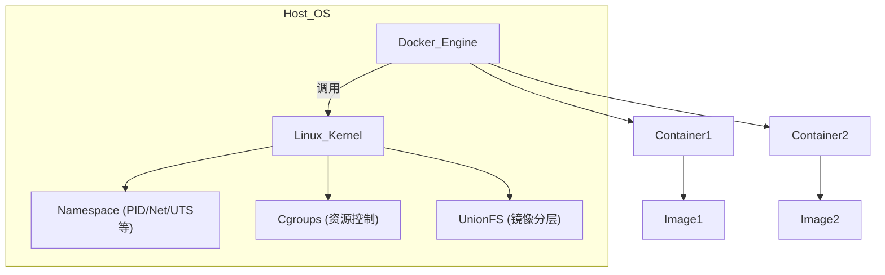
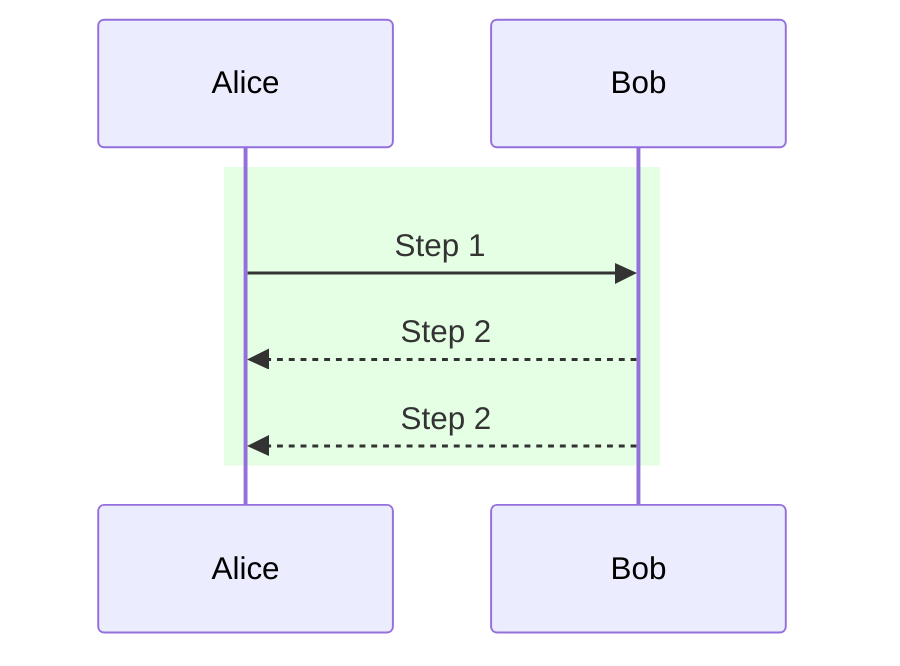
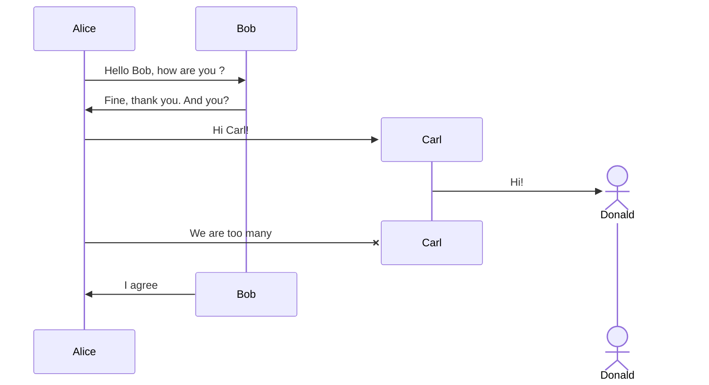
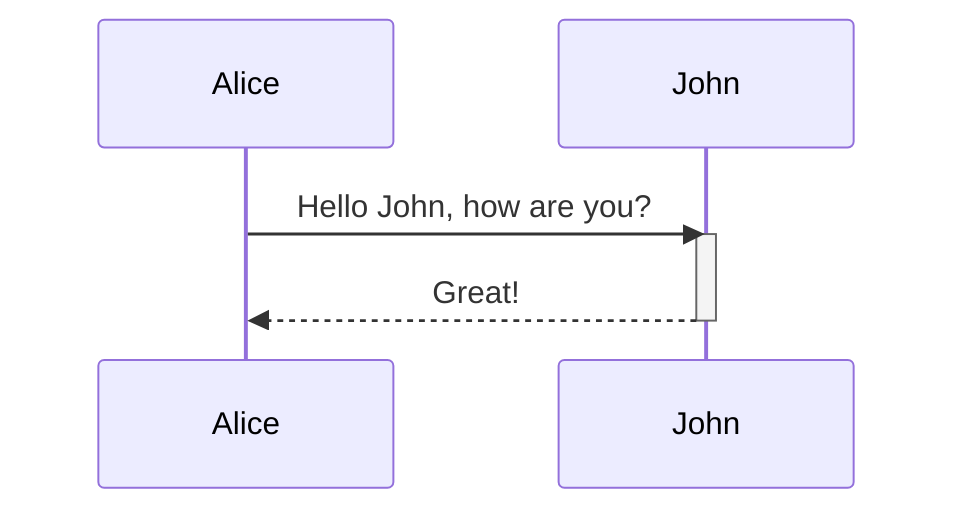
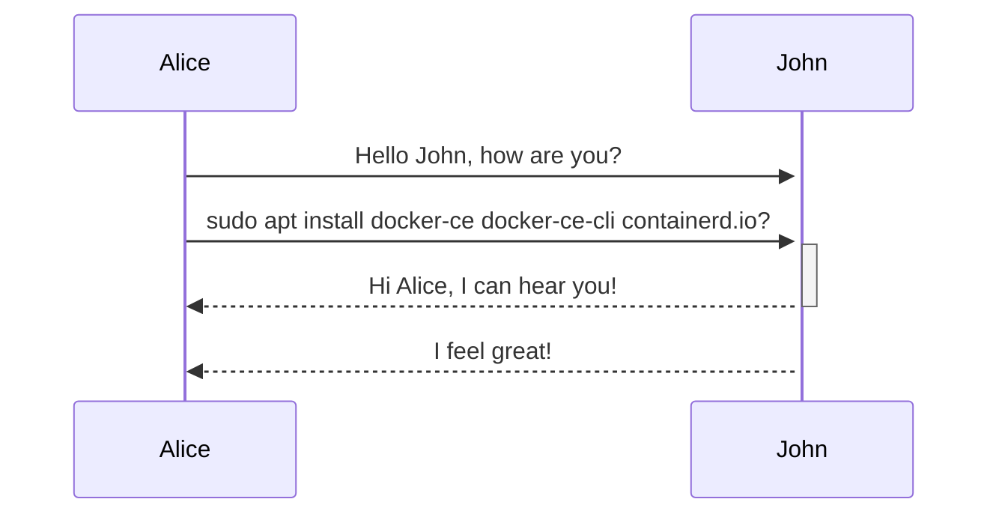
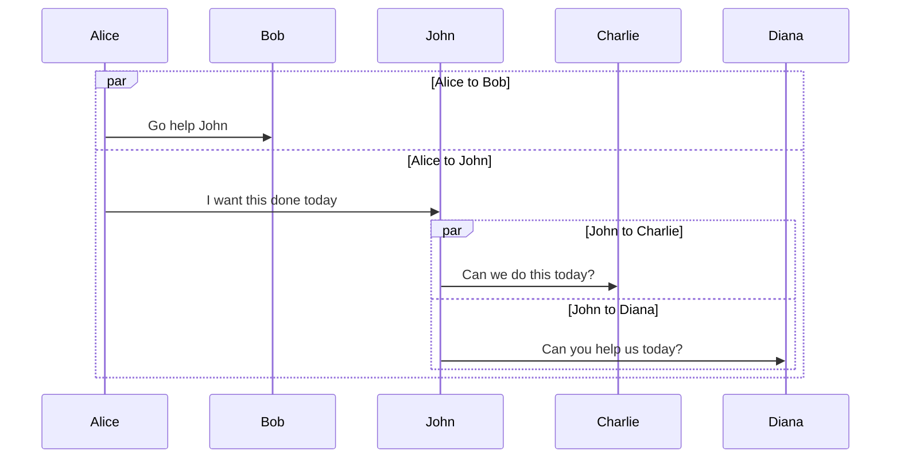
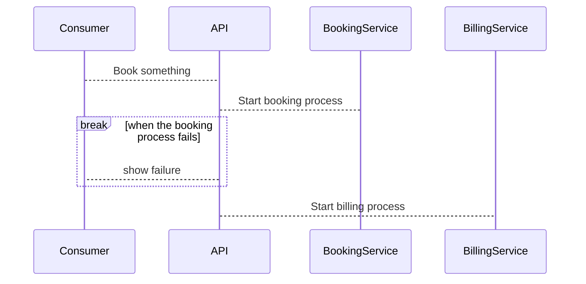
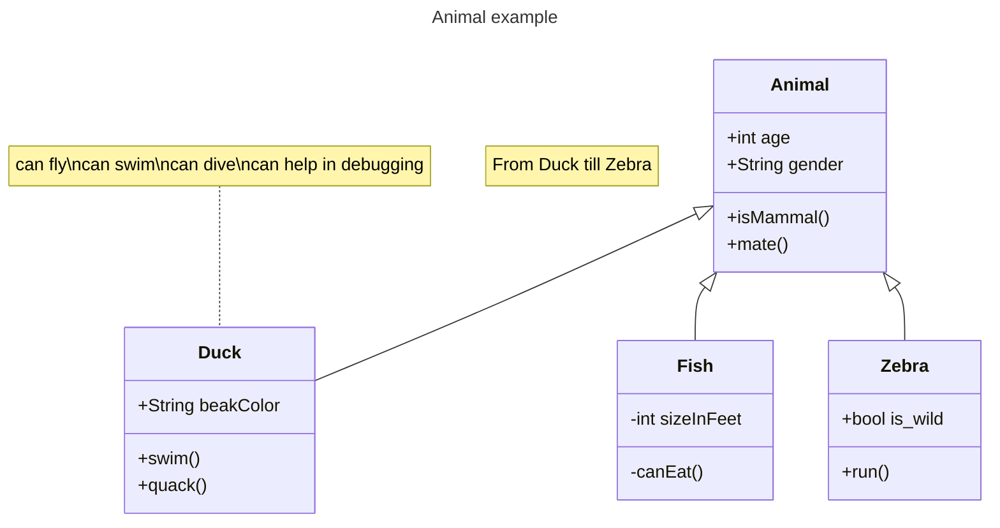

<!--
 * @Author: baineng.shou baineng.shou@nio.com
 * @Date: 2025-04-20 20:35:04
 * @LastEditors: baineng 491636840@qq.com
 * @LastEditTime: 2025-04-21 11:21:27
 * @FilePath: /vold/123.md
 * @Description: 这是默认设置,请设置`customMade`, 打开koroFileHeader查看配置 进行设置: https://github.com/OBKoro1/koro1FileHeader/wiki/%E9%85%8D%E7%BD%AE
-->

[mermaid官方文档](https://mermaid.js.org/syntax/flowchart.html)

# class diagram

