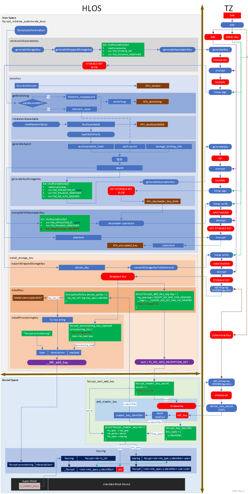

```mermaid
sequenceDiagram
    Note over fstab.common:/devices/platform/soc@0/a8f8800.usb/*/usb*<br/>auto auto defaults voldmanaged=usb1:auto
    fstab.common -->> /etc/fstab:device-common.mk
    vold->>+vold:process_config
    Note over fstab.cpp: system/core/fs_mgr/libfstab/fstab.cpp
    vold->>+fstab.cpp:ReadFstabFromFile
    fstab.cpp-->>-/etc/fstab:ReadFstabFromFileCommon

    fstab.cpp->>+fstab.cpp:ParseFstabFromString
    Note over fstab.cpp: 解析fstab(in FstabEntry：blk_device,<br/>fs_type,mount_point,ParseMountFlags)

    fstab.cpp->>+vold:fstab_default
    vold->>+vold:nickname(entry.label)

    vold->>-disk:nickname

```


fstab（文件系统表） 是 Linux 系统中用于定义文件系统挂载信息的配置文件

