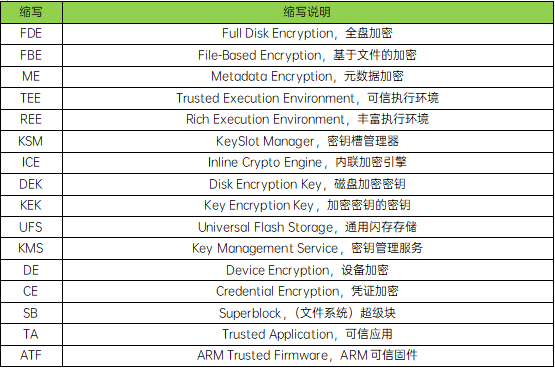

用户数据加密是移动设备的重要功能，是使用对称加密算法对Android设备上的所有用户数据进行编码的过程，防止用户数据被未经授权的用户或应用程序访问

涉及VOLD、Linux Kernel Keyring、Linux Kernel Fscrypt、KSM、Keymaster和ICE，不涉及VOLD子系统存储管理、Fscrypt用户空间部分和F2FS文件系统IO处理等



File-Based Encryption，基于文件加密，由于Android将userdata partition格式化为F2FS类型文件系统，所以也可以理解为基于F2FS类型系统的加密

```mermaid
sequenceDiagram
    init.rc -->> builtins.cp:do_mount_all


    vold->>+vold:process_config
    Note over fstab.cpp: system/core/fs_mgr/libfstab/fstab.cpp
    vold->>+fstab.cpp:ReadFstabFromFile
    fstab.cpp-->>-/etc/fstab:ReadFstabFromFileCommon

    fstab.cpp->>+fstab.cpp:ParseFstabFromString
    Note over fstab.cpp: 解析fstab(in FstabEntry：blk_device,<br/>fs_type,mount_point,ParseMountFlags)

    fstab.cpp->>+vold:fstab_default
    vold->>+vold:nickname(entry.label)

    vold->>-disk:nickname

```

1. init.rc 调用 mount_all 命令挂载 userdata partition 分区
   [源码路径](http://aospxref.com/android-13.0.0_r3/xref/system/core/rootdir/init.rc#522)


2. do_mount_all 命令读取并解析fstab挂载文件，在挂载userdata partition后发送event
   [源码路径](http://aospxref.com/android-13.0.0_r3/xref/system/core/init/builtins.cpp#637)


```bash
/dev/block/platform/soc@0/1d84000.ufshc/by-name/userdata  data  ext4
discard,noatime,noauto_da_alloc,
data=ordered,user_xattr,barrier=1,inlinecrypt	latemount,wait,formattable,
fileencryption=aes-256-xts:aes-256-cts:v2+inlinecrypt_optimized,
keydirectory=/metadata/vold/metadata_encryption,quota
```

